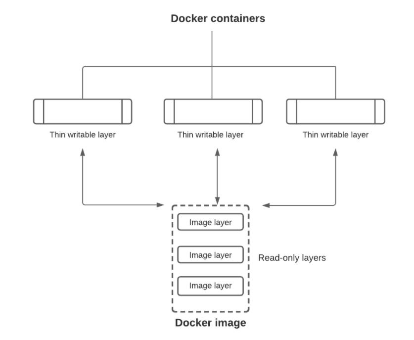
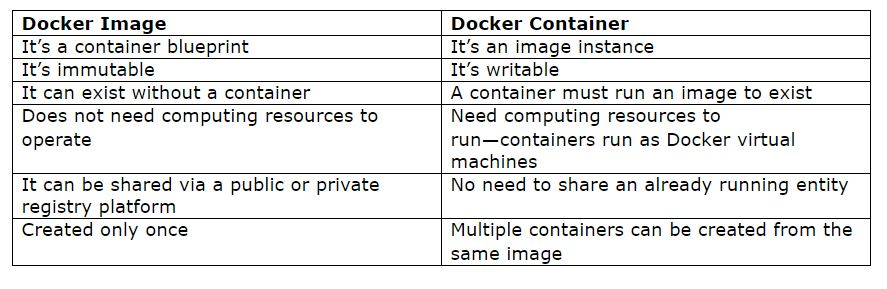

# Terminology

## Table of Contents
1. [Image](#image)
2. [Container](#container)
3. [Dockerfile](#docker-file)
4. [Docker Daemon](#docker-daemon)
5. [Docker Client](#docker-client)
6. [Docker Hub](#docker-hub)

### Image
A Docker image is a read-only, inert template that comes with instructions for deploying containers. In Docker, everything basically revolves around images.
An image consists of a collection of files (or layers) that pack together all the necessities—such as dependencies, source code, and libraries—needed to set up a completely functional container environment.
Images are stored on a Docker registry, such as the Docker Hub, or on a local registry.

#### Image download
When the image is deployed to a Docker environment, it can be executed as a Docker container. 
In order to first download an image, we can use the `docker pull` command. For example, if I wanted to pull the `busybox` image, I would use `docker pull busybox`.
The `docker run` command creates a container from a specific image. We can download and run the image directly in one go using the `docker run` command; by using `docker run busybox`, this will first download the `busybox` image, and then run it. 

#### Image layers
A Docker image is made up of **multiple layers**. The image layers are stacked to one another. Although the layers may be different from each other, every one of them may depend on the one immediately below it.
These layers, also called intermediate images, are essentially read-only files that a container layer will be added on top of them after setting up a virtualized environment. Once a container is created, a writable layer is added on top of the unchangeable images, allowing a user to make changes.

Docker images are a reusable asset - deployable on any host. Developers can take the static image layers from one project and use them in another. This saves the user time, because they do not have to recreate an image from scratch.

#### Image attributes
We can use the `docker images` command to view an image’s details on our system.
An image has the following attributes:
* **Tag:** identifies the image by its tag, such as version number.
* **Image ID:** is a unique image identity.
* **Created:** the period of time since it was created.
* **Size:** the image’s virtual size.

#### Image types
For simplicity, you can think of an image akin to a git repository - images can be committed with changes and have multiple versions. If you don't provide a specific version number, the client defaults to latest. For example, you can pull a specific version of ubuntu image

To get a new Docker image you can either get it from a registry (such as the Docker Hub) or create your own. There are tens of thousands of images available on Docker Hub. You can also search for images directly from the command line using docker search.

An important distinction to be aware of when it comes to images is the difference between base and child images.

* **Base images** are images that have no parent image, usually images with an OS like ubuntu, busybox or debian.
* **Child images** are images that build on base images and add additional functionality.

Then there are official and user images, which can be both base and child images.

* **Official images** are images that are officially maintained and supported by the folks at Docker. These are typically one word long. In the list of images above, the python, ubuntu, busybox and hello-world images are official images.
* **User images** are images created and shared by users like you and me. They build on base images and add additional functionality. Typically, these are formatted as user/image-name.

### Container
Containers are created from Docker images, and they run the actual application. A Docker container is a virtualized runtime environment that provides isolation capabilities for separating the execution of applications from the underpinning system. It is an instance of a Docker image.
Containers are the ultimate utility of the Docker technology: they provide a portable and lightweight environment for deploying applications.
Each container is autonomous and runs in its own isolated environment, ensuring it does not disrupt other running applications or its underlying system. This greatly improves the security of applications.

We create a container using `docker run`, which we did by using the busybox image that we downloaded. A list of running containers can be seen using the `docker ps` command (`docker ps -a` outputs both running and stopped containers).
Docker defines several **container states**, such as `created`, `restarting`, `running`, `paused`, `exited`, and `dead`. Since several states are possible, and a container is just an instance of the image, a container does not need to be running.

Every time Docker creates a container from an image, it places a thin read-write layer on top of the image. This writable layer allows for changes to be made to the container, as the lower layers in the image are unchangeable. It also stores any changes made to the container during its entire runtime.

If we want to keep the changes made to the initial image for future use, you can take a screenshot to save the current state of the container. This will add a container layer atop the image, eventually creating a new immutable image.
Furthermore, it’s possible to launch **multiple container instances** simultaneously from the **same image**. Every container layer will maintain its own individual state safely atop the underlying image. The containers will have different IDs, but arise from the same image.

Creating multiple containers from the same image can be very beneficial. For example, it increases the availability of an application—in case one container fails, the others will ensure the application is still up and running. Duplicate containers also help in scaling up an application in case demand surges upwards.

### Difference between Docker container and image
A Docker container is a virtualized runtime environment used in application development. It is used to create, run and deploy applications that are isolated from the underlying hardware. A Docker container can use one machine, share its kernel and virtualize the OS to run more isolated processes. As a result, Docker containers are lightweight.

A Docker image is like a snapshot in other types of VM environments. It is a record of a Docker container at a specific point in time. Docker images are also immutable. While they can't be changed, they can be duplicated, shared or deleted. The feature is useful for testing new software or configurations because whatever happens, the image remains unchanged.

Containers need a runnable image to exist. Containers are dependent on images, because they are used to construct runtime environments and are needed to run an application.

A simple analogy that compares their differences is to think of a Docker image as a recipe and a container as the cake prepared from that recipe.
The recipe sets out the instructions for baking the cake. We cannot enjoy eating the cake if we do not put the instructions into action.
We need to follow the recipe to prepare the cake and eat it. Similarly, we should follow the instructions in the Docker image to create and start a container, and enjoy the benefits of Docker.

We can bake as many cakes as possible from a single recipe—just like an image can create multiple containers. However, if we change the recipe, the taste of our existing cakes will not change.
Only newly baked cakes will use the modified recipe. Likewise, if we make changes to a container image, we will not affect the already running containers.

The table below summarizes the differences between a Docker container and image.

### Dockerfile
When we run the `docker run` command and specify an image (e.g., `busybox`), Docker uses the Dockerfile to build the image itself.
A Dockerfile is a simple text file that contains a list of commands that the Docker client calls while creating an image. It's a simple way to automate the image creation process. The best part is that the commands we write in a Dockerfile are almost identical to their equivalent Linux commands. This means we don't really have to learn new syntax to create our own dockerfiles.

The advantage of a Dockerfile over just storing the binary image (or a snapshot/template in other virtualization systems) is that the automatic builds will ensure we have the latest version available. This is a good thing from a security perspective, as we want to ensure that we are not installing any vulnerable software.

### Docker Daemon
The Docker daemon (`dockerd`) is a persistent background process that manages Docker images, containers, networks, and storage volumes. The Docker daemon constantly listens for Docker API requests and processes them. Is the process that runs in the operating system which clients talk to.

When you use the `docker run` command to start up a container, your Docker client will translate that command into an HTTP API call, will send it to Docker daemon, Docker daemon will then evaluate the request, talk to the underlying operating system and provision your container.

### Docker Client
The Docker client (`docker`) is the command line tool that allows the user to interact with the daemon. More generally, there can be other forms of clients too - such as Kitematic which provide a GUI to the users.

The Docker client is the primary way that many Docker users interact with Docker. When you use commands such as `docker run`, the client sends these commands to `dockerd`, which carries them out. The docker command uses the Docker API. The Docker client can communicate with more than one daemon.

### Docker Registry
A Docker registry stores Docker images. Docker Hub is a public registry that anyone can use, and Docker is configured to look for images on Docker Hub by default. You can even run your own private registry.

When you use the `docker pull` or `docker run` commands, the required images are pulled from your configured registry. When you use the `docker push` command, your image is pushed to your configured registry.
